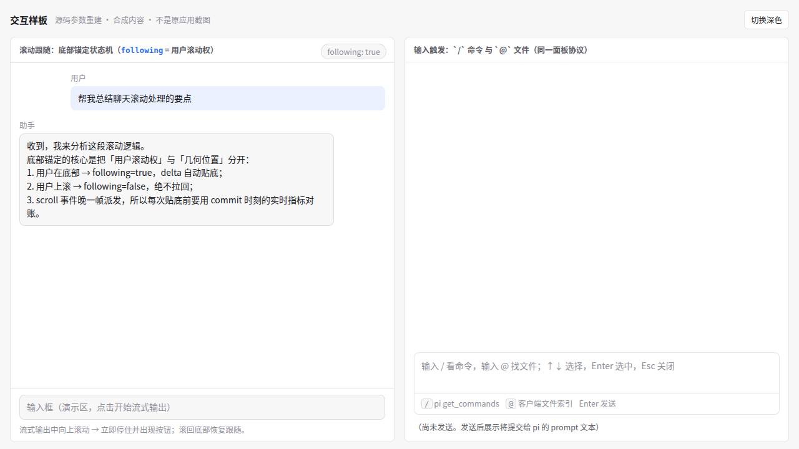
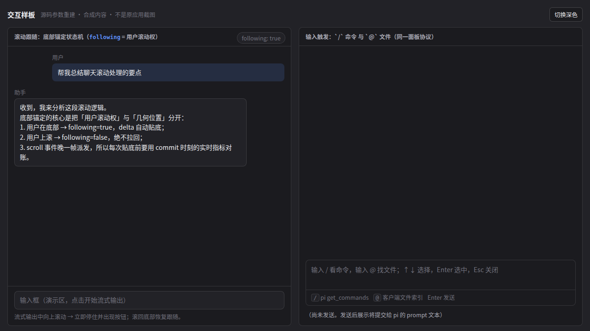

# Pi Chat Interactions

自包含的对话流交互技能，面向 **React + Tauri + pi 0.86.1**。

覆盖四块能力：滚动跟随（打开会话贴底、流式跟随、用户上滚立即让位、回到底部按钮、会话滚动记忆）、输入框贴图/拖放（进 pi RPC `images`）、`/` 命令面板（接 pi `get_commands`）、`@` 文件模糊引用（客户端索引 + markdown 产物）。内置纯函数参考实现、离线交互样板与验收清单，不需要获取外部参考仓库。

与 [pi-chat-ui](https://github.com/skywangc/pi-chat-ui)（整体布局、Markdown 渲染、工具/思考/子代理展示）互补，两者可同项目并用。

## 安装

推荐使用 [skills CLI](https://skills.sh)（自动识别 Pi、Claude Code 等已安装的 agent 并建立链接，支持统一更新）：

```bash
# 项目级安装（在目标项目根目录执行）
npx skills add skywangc/pi-chat-ui@pi-chat-interactions

# 全局安装（本机所有项目可用）
npx skills add skywangc/pi-chat-ui@pi-chat-interactions -g
```

检查与更新已安装的技能：

```bash
npx skills check    # 检查更新
npx skills update   # 更新全部技能
```

也可以用 Git 直接安装到项目（若目标目录已存在，先检查，避免覆盖已有技能）：

```bash
git clone https://github.com/skywangc/pi-chat-ui.git
cp -r pi-chat-ui/skills/pi-chat-interactions .agents/skills/
```

支持 `.agents/skills` 的 coding agent 可以在项目中发现该技能。其他工具可把整个仓库目录放入其支持的技能目录，保留 `SKILL.md`、`references/`、`assets/` 的相对结构。

## 使用

在支持 `$` 调用方式的工具中：

> 使用 $pi-chat-interactions，先实现滚动跟随并用内置样板验证状态机，再做输入框贴图与 `/`、`@` 面板，最后按验收清单逐条过。

入口：[SKILL.md](SKILL.md)。来源与许可见 [licenses](licenses/)。

## 离线样板

直接用浏览器打开 `assets/reference-board.html`：左栏是底部锚定状态机演示（流式贴底、上滚让位、回到底部），右栏是 `/` 与 `@` 触发面板演示（键盘导航、模糊过滤、mention 产物）。样板不请求模型服务，不加载 CDN 或外部字体。





## 校验与更新

```bash
python3 scripts/validate_bundle.py
```

通过 skills CLI 安装的技能，在本机任意位置执行 `npx skills update` 即可更新。用 Git 直接安装的，可在技能目录执行 `git pull --ff-only` 更新；有本地改动时先保存并核对差异。

校验器检查本地链接、离线资源闭包、状态机常量与协议关键词一致性。样板与截图是按参考参数重建的交互演示，不是原产品截图，也不代表实际 pi/provider 联调已完成。应用运行仍需要自己的 React、Tauri 和 pi 环境。

## 许可与来源

本仓库按 [Apache-2.0](LICENSE) 分发；交互实现的提炼来源、归属与适用的第三方许可保留在 [licenses](licenses/) 中。复制相关资产时同时保留对应声明。
