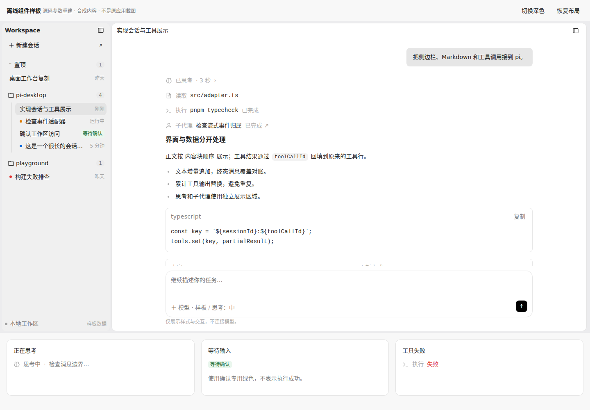
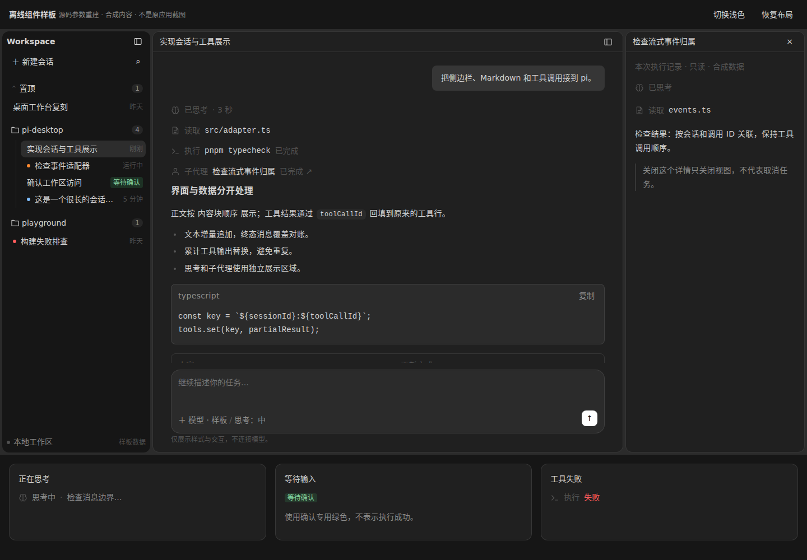

# Pi Chat UI

自包含的工作台式对话 UI 技能，面向 **React + Tauri + pi 0.86.1**。

覆盖流式 Markdown、模型消息适配、工具调用、思考过程和子代理详情（侧边栏概要见包内参考，深入实现用 pi-chat-sidebar 技能）。内置浅色/深色主题、组件参数、离线交互样板与合成事件，不需要获取外部 UI 产品仓库。

## 安装
推荐使用 [skills CLI](https://skills.sh)（自动识别 Pi、Claude Code 等已安装的 agent 并建立链接，支持统一更新）：

```bash
# 项目级安装（在目标项目根目录执行）
npx skills add skywangc/pi-chat-ui -s pi-chat-ui

# 全局安装（本机所有项目可用）
npx skills add skywangc/pi-chat-ui -s pi-chat-ui -g
```

检查与更新已安装的技能：

```bash
npx skills check    # 检查更新
npx skills update   # 更新全部技能
```

也可以用 Git 直接安装到项目（若目标目录已存在，先检查，避免覆盖已有技能）：

```bash
git clone https://github.com/skywangc/pi-chat-ui.git
cp -r pi-chat-ui/skills/pi-chat-ui .agents/skills/
```

支持 `.agents/skills` 的 coding agent 可以在项目中发现该技能。其他工具可把整个仓库目录放入其支持的技能目录，保留 `SKILL.md`、`references/`、`assets/` 的相对结构。

也可以向支持安装 GitHub 技能的助手发送：

> 从 https://github.com/skywangc/pi-chat-ui 安装技能，名称为 pi-chat-ui，技能位于仓库 skills/pi-chat-ui/ 目录。

## 使用

在支持 `$` 调用方式的工具中：

> 使用 $pi-chat-ui，实现主对话区（侧边栏用 $pi-chat-sidebar）；先用内置样例验证视觉和消息更新，再接入项目中的 pi 0.86.1。

入口：[SKILL.md](SKILL.md)。接入步骤：[integration.md](references/integration.md)。

## 离线样板

直接用浏览器打开 `assets/reference-board.html`，或从仓库根目录启动本机静态服务：

```bash
python3 -m http.server 8769 --bind 127.0.0.1 --directory assets
```

访问 `http://127.0.0.1:8769/reference-board.html`。样板不请求模型服务，不加载 CDN 或外部字体。





## 校验与更新

```bash
python3 scripts/validate_bundle.py
```

通过 skills CLI 安装的技能，在本机任意位置执行 `npx skills update` 即可更新。用 Git 直接安装的，可在技能目录执行 `git pull --ff-only` 更新；有本地改动时先保存并核对差异。

校验器检查本地引用、主题变量、离线资源和 RPC 样例格式。样板与截图是源码参数重建参考，不是原产品截图，也不代表实际 pi/provider 联调已完成。应用运行仍需要自己的 React、Tauri 和 pi 环境。

## 许可与来源

本仓库按 [Apache-2.0](LICENSE) 分发；上游归属和适用的第三方许可保留在 [licenses](licenses/) 中。复制相关资产时同时保留对应声明。来源记录不构成运行依赖。
